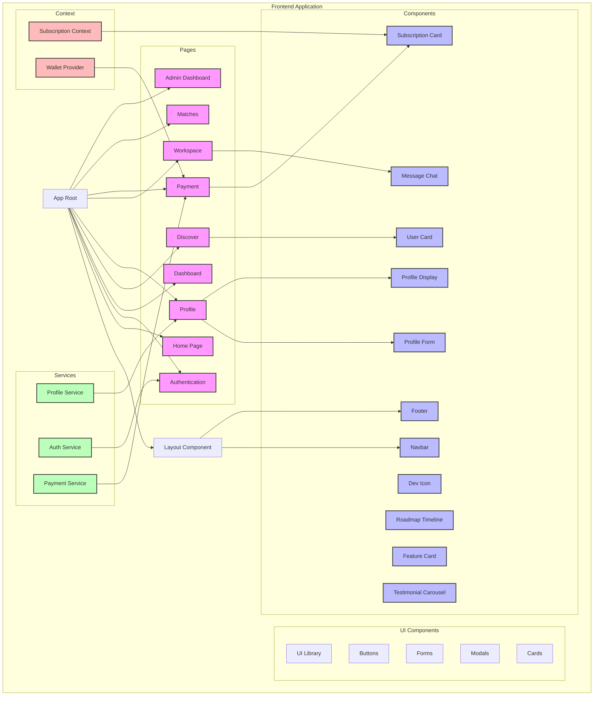

# BuddyFi Application Architecture



## Key Features and Data Flow

1. **Authentication Flow**
   - User authentication handled through Auth Service
   - Protected routes and session management
   - Wallet integration for Web3 features

2. **Profile Management**
   - Profile creation and editing
   - Skill tags and user information
   - Profile display and matching

3. **Workspace Features**
   - Real-time messaging
   - Collaboration tools
   - Project management

4. **Payment Integration**
   - Subscription management
   - Payment processing
   - Trial period handling

5. **Discovery and Matching**
   - User discovery
   - Matching algorithm
   - Connection management

## Component Hierarchy

1. **Layout Components**
   - Navbar
   - Footer
   - Global layout wrapper

2. **Feature Components**
   - User cards
   - Profile forms
   - Message chat
   - Subscription cards

3. **UI Components**
   - Reusable UI elements
   - Form components
   - Modal components
   - Card components

## Data Management

1. **Context Providers**
   - Subscription context
   - Wallet provider
   - Authentication state

2. **Services**
   - Profile service
   - Authentication service
   - Payment service

## File Structure

```
buddyfi/
├── app/                    # Next.js app directory
│   ├── (auth)/            # Authentication routes
│   ├── dashboard/         # Dashboard pages
│   ├── discover/          # Discovery features
│   ├── profile/           # Profile management
│   ├── workspace/         # Workspace features
│   ├── payment/           # Payment processing
│   ├── matches/           # Matching system
│   └── adminbuddy/        # Admin dashboard
├── components/            # Reusable components
│   ├── ui/               # UI components
│   ├── data/            # Data display components
│   └── solana/          # Blockchain components
├── context/              # React context providers
├── services/             # API services
├── hooks/               # Custom React hooks
├── utils/               # Utility functions
├── types/               # TypeScript types
└── public/              # Static assets
```

This architecture diagram provides a comprehensive overview of the application structure, component relationships, and data flow. You can import this Mermaid diagram into Figma by:

1. Copy the Mermaid code
2. Use a Mermaid to SVG converter
3. Import the SVG into Figma
4. Customize the styling and layout as needed

The diagram shows the main application structure, component hierarchy, and how different parts of the application interact with each other. It's designed to be clear and organized, making it suitable for stakeholder presentations. 