# BuddyFi Architecture Diagram

```mermaid
graph TB
    %% Main Application Structure
    subgraph "BuddyFi Application"
        direction TB
        
        %% Pages/Routes
        subgraph "Pages"
            Home[Home Page]
            Auth[Authentication]
            Dashboard[Dashboard]
            Discover[Discover]
            Profile[Profile]
            Workspace[Workspace]
            Payment[Payment]
            Matches[Matches]
            Admin[Admin Dashboard]
        end

        %% Core Components
        subgraph "Core Components"
            Navbar[Navbar]
            Footer[Footer]
            ProfileCreator[Profile Creator]
            ProfileForm[Profile Form]
            ProfileDisplay[Profile Display]
            UserCard[User Card]
            MessageChat[Message Chat]
            SubscriptionCard[Subscription Card]
        end

        %% UI Components
        subgraph "UI Components"
            DevIcon[Dev Icon]
            RoadmapTimeline[Roadmap Timeline]
            FeatureCard[Feature Card]
            TestimonialCarousel[Testimonial Carousel]
            CodeBlock[Code Block]
        end

        %% Services
        subgraph "Services"
            ProfileService[Profile Service]
        end

        %% Context/State Management
        subgraph "State Management"
            SubscriptionContext[Subscription Context]
            WalletProvider[Wallet Provider]
        end

        %% Data Flow
        Home --> Navbar
        Home --> Footer
        Home --> FeatureCard
        Home --> TestimonialCarousel
        
        Auth --> ProfileCreator
        ProfileCreator --> ProfileForm
        
        Dashboard --> UserCard
        Dashboard --> MessageChat
        
        Profile --> ProfileDisplay
        Profile --> ProfileForm
        
        Workspace --> CodeBlock
        Workspace --> DevIcon
        
        Payment --> SubscriptionCard
        
        %% Service Connections
        ProfileService --> ProfileCreator
        ProfileService --> ProfileForm
        ProfileService --> ProfileDisplay
        
        %% Context Connections
        SubscriptionContext --> SubscriptionCard
        WalletProvider --> Payment
    end

    %% Styling
    classDef page fill:#E3F2FD,stroke:#1976D2,stroke-width:2px
    classDef component fill:#F3E5F5,stroke:#7B1FA2,stroke-width:2px
    classDef service fill:#E8F5E9,stroke:#388E3C,stroke-width:2px
    classDef context fill:#FFF3E0,stroke:#F57C00,stroke-width:2px
    
    class Home,Auth,Dashboard,Discover,Profile,Workspace,Payment,Matches,Admin page
    class Navbar,Footer,ProfileCreator,ProfileForm,ProfileDisplay,UserCard,MessageChat,SubscriptionCard,DevIcon,RoadmapTimeline,FeatureCard,TestimonialCarousel,CodeBlock component
    class ProfileService service
    class SubscriptionContext,WalletProvider context
```



## File Structure

```
buddyfi/
├── app/                    # Next.js app directory
│   ├── (auth)/            # Authentication routes
│   ├── adminbuddy/        # Admin dashboard
│   ├── api/               # API routes
│   ├── dashboard/         # User dashboard
│   ├── discover/          # Discovery page
│   ├── matches/           # Matches page
│   ├── payment/           # Payment processing
│   ├── profile/           # User profile
│   └── workspace/         # Workspace features
├── components/            # Reusable components
│   ├── data/             # Data-related components
│   ├── solana/           # Solana integration components
│   └── ui/               # UI components
├── context/              # React context providers
├── hooks/               # Custom React hooks
├── lib/                 # Utility libraries
├── public/              # Static assets
├── services/            # Service layer
│   └── profile/         # Profile-related services
├── types/               # TypeScript type definitions
└── utils/               # Utility functions
```

## Key Features and Data Flow

1. **Authentication Flow**
   - User authentication through (auth) routes
   - Profile creation and management
   - Wallet connection through WalletProvider

2. **Core Features**
   - Dashboard for user overview
   - Profile management and display
   - Discovery and matching system
   - Workspace collaboration
   - Payment and subscription management

3. **Data Management**
   - Profile data handled by ProfileService
   - Subscription state managed by SubscriptionContext
   - Wallet integration through WalletProvider

4. **UI Components**
   - Reusable UI components in components/ui
   - Feature-specific components in components/
   - Solana integration components

## Component Relationships

1. **Profile System**
   - ProfileCreator → ProfileForm → ProfileDisplay
   - ProfileService manages data flow
   - UserCard displays profile information

2. **Subscription System**
   - SubscriptionCard displays plans
   - SubscriptionContext manages state
   - Payment routes handle transactions

3. **Workspace Features**
   - CodeBlock for code display
   - DevIcon for developer identification
   - MessageChat for communication

4. **Navigation**
   - Navbar for main navigation
   - Footer for additional links
   - Dashboard as central hub 