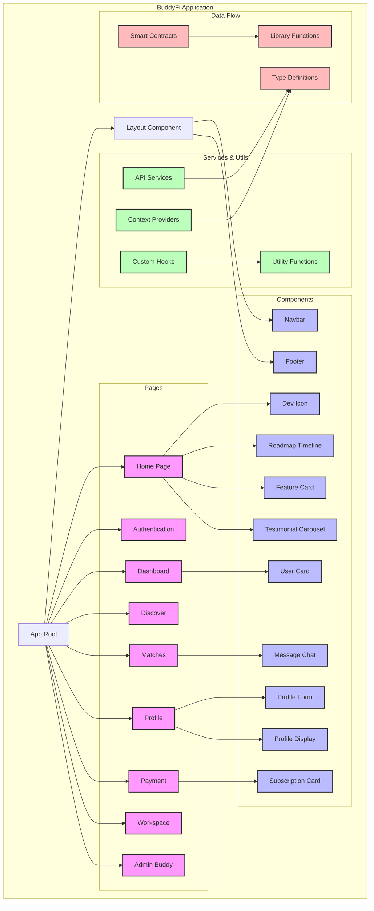

# BuddyFi Architecture Diagram

This diagram represents the architecture of the BuddyFi application, showing the main components, their relationships, and data flow. The diagram is created using Mermaid.js syntax and can be imported into Figma or other diagramming tools.

## Key Components:

1. **Pages**
   - Home
   - Authentication
   - Dashboard
   - Discover
   - Matches
   - Profile
   - Payment
   - Workspace
   - Admin Buddy

2. **Core Components**
   - Navbar
   - Footer
   - User Card
   - Profile Form/Display
   - Message Chat
   - Subscription Card
   - Dev Icon
   - Roadmap Timeline
   - Feature Card
   - Testimonial Carousel

3. **Services & Utils**
   - API Services
   - Context Providers
   - Custom Hooks
   - Utility Functions

4. **Data Flow**
   - Type Definitions
   - Smart Contracts
   - Library Functions

## Color Coding:
- Pink: Pages
- Blue: Components
- Green: Services
- Red: Data/Type definitions

## How to Use:
1. Copy the Mermaid diagram code
2. Import into Figma or any Mermaid-compatible tool
3. Customize colors and styling as needed
4. Add additional details or modify relationships as required 